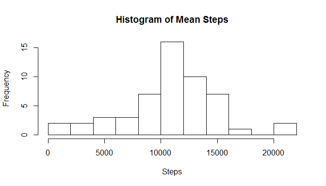
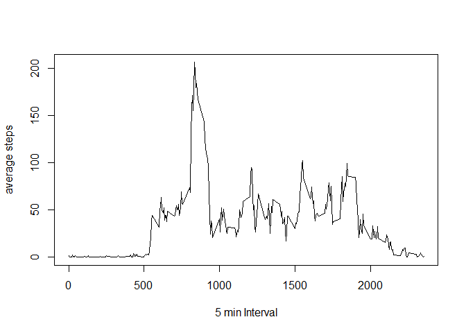
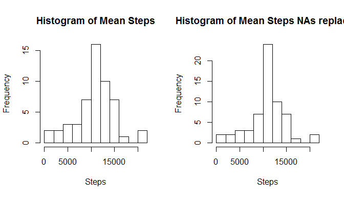
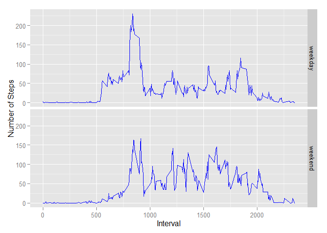

# Reproducible Research: Peer Assessment 1


## Loading and preprocessing the data


```r
data<-read.csv("activity.csv")
ag1<-aggregate(steps ~ date,data,sum)
num_nas<-length(which(is.na(data$steps)))
```

## What is mean total number of steps taken per day?
Histogramm showing the total number of Steps taken each day:

```r
hist(ag1$steps,breaks="FD",main="Histogram of Mean Steps", xlab="Steps")
```

 

The mean of the total number of steps taken per day is:

```r
mean(ag1$steps)
```

```
## [1] 10766.19
```

The median of the total number of steps taken per day is:

```r
median(ag1$steps)
```

```
## [1] 10765
```

## What is the average daily activity pattern?

```r
#group by interval, order by steps, take the first elem which is maximum
ag2<-aggregate(steps ~ interval,data,mean)
ag3<-ag2[order(-ag2$steps),]
maxinterval<-ag3[1,1]
names(ag3)[2]<-"av"
plot(ag2$interval,ag2$steps,type="l",xlab="5 min Interval",ylab="average steps")
```

 

The interval  835 contains the max number of steps.

## Imputing missing values


```r
# use the average over all steps per interval to replace NAs in the original data 
# merge original data with the average per interval data and add a column which replaces NA values
data2<-merge(data,ag3)
data2$stepsn<-data2$steps
for (i in 1:length(data2$steps)){if(is.na(data2$steps[i])) { data2$stepsn[i]<-data2$av[i]}}

data3<-data2[order(data2$date,data2$interval),]
ag1n<-aggregate(stepsn ~ date,data3,sum)
ag2n<-aggregate(stepsn ~ interval,data3,mean)
```
The number of NAs in the data set is 2304.

## What is mean total number of steps taken per day?
The mean of total number of steps taken per day is:

```r
mean(ag1n$stepsn)
```

```
## [1] 10766.19
```

The median of total number of steps taken per day is:

```r
median(ag1n$stepsn)
```

```
## [1] 10766.19
```

The difference of the mean and medians is:

```r
mean(ag1n$stepsn)-mean(ag1$steps)
```

```
## [1] 0
```

```r
median(ag1n$stepsn)-median(ag1$steps)
```

```
## [1] 1.188679
```
This shows the difference in the original and the new data (NAs replaced):

```r
par(mfcol = c(1, 2))
hist(ag1$steps,breaks="FD",main="Histogram of Mean Steps", xlab="Steps")
hist(ag1n$stepsn,breaks="FD",main="Histogram of Mean Steps NAs replaced", xlab="Steps")
```

 

## Are there differences in activity patterns between weekdays and weekends?

```r
library(timeDate)
library(ggplot2)
d<-as.Date(data3$date,"%Y-%m-%d")
data3$wday<-as.factor(ifelse(isWeekday(d),"weekday","weekend"))

ag4<-aggregate(stepsn ~ interval+wday,data3,mean)
g <- ggplot(ag4, aes(interval, stepsn))
g+geom_line(colour="blue")+ facet_grid(wday ~ .)+xlab("Interval")+ylab("Number of Steps")
```

 
